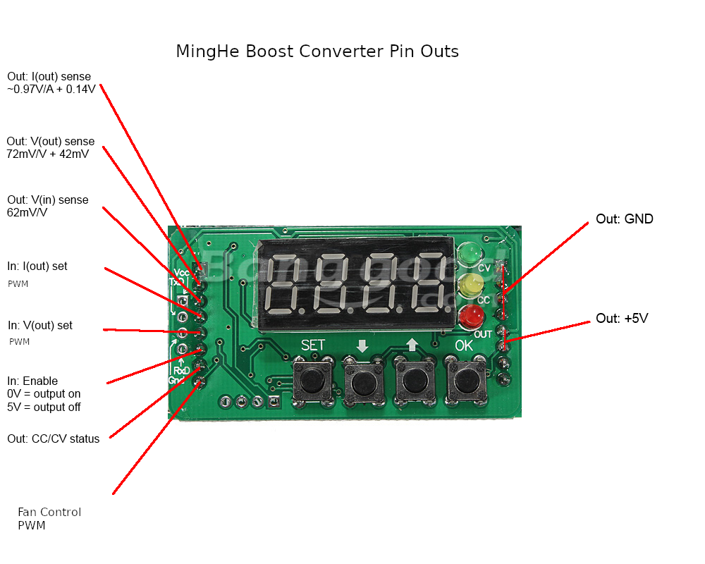

# BST900
### Control of Boost Converter over serial interface

This is a fork of B3603 originally by [baruch](https://github.com/baruch/b3603) and later forked by iafilius and frmaioli
This fork extends the code to support the BST900 and BST400 boost converters from MingHe.
The object of the BST900 alternative firmware is to allow control of the boost converter over a serial interface. In my case this is to control the charge current of my home battery system

The plugin top board of BST900 has a convenient unused serial socket (CNOS logic levels), which can be easily connected to a suitable controller. (In my case an ESP8266).
BST900 and BST400 have a different architecture to the original B3603. They use a UCC3803 Current Mode PWM controller on their bottom boards, but they all use the same  STM8 based microcontroller top board albeit running slightly different firmware.
I believe the B3603 code should be able to be adapted to drive the BST range.

The project is a work in progress. There is no code to try out just yet. I am still awaiting delivery of my STM8 development boards.

## Alternatives to this firmware
There is another way to control the current delivered by a BST900 without having to change the firmware. It is possible to set the constant current limit using either an analogue or digital potentiometer.

Looking at the BST900. The fourth pin down on the left hand row is the pin used to control the Constant Current limit of UCC38803. This pin carries a digital PWM signal from the top board. However the UCC3803
 will work equally well with an analogue voltage on this pin.
 
 ##### Procedure
 * Put the top board on long pin header sockets to raise it up.
 * Bend Pin 4 of the left hand header out so this pin is open circuited.
 * Insert a wire into Pin 4 of the socket on the lower board and connect to the wiper of a 10k Potentiometer (or Digipot)
 * Connect one side of the potentiometer to GND which is found 2nd terminal on the left in the row of 4 immediately to the left of the buttons.
 * Connect the other side of the potentiometer to +3.3V via a resistor of 15-20k. 3.3V is found at the right hand terminal of the row of 4.
 
 That's it.  Hopefully it will not blow up!  It is probably a good idea to feed the BST900 with a constant current source while testing it out.

## BST900 Architecture

BST900 is based on the UCC3803 Current Mode PWM Controller from TI. It boosts voltages up to 120V and operates at currents up to 15A.
The output voltage is controlled by a PWM signal on pin5 of the upper board in exactly the same way as B3603. Pin4 carries a PWM signal whose width determines the Constant Current limit.

## Improved Cooling
While the manufacturer specifies the BST900 as operating at up to 15A looking at the size of the supplied heatsink I was not too hopeful about it actually working for long at that current.
It is fairly easy to uprate the cooling by removing the MOSFET and diode pair and mounting them on the lower side of the PCB with a much larger heat sink. BST900 also has an unused socket for a second diode 
pair. Adding a second diode will more than halve the heat dissipation of each diode since the lower current will mean the diode is operating at a lower forward voltage. If adding a diode be sure to make sure they are both of the
 same type.
 
 

## ToDo

* Implement a PWM control for the cooling fan.
* Rework Constant Current control to suit BST900. (May not be necessary)
* Implement a start at power on feature to suit my application for charging a home battery system.
* Recalibrate all measurements and PWM to suit BST900
* Rework code to use a 10mV voltage resolution to allow voltages above 65535mV

Original project page appears below.
=============================================================================

# B3603

This project is about reverse engineering the B3603 control board and figuring
out how it works, then it should be possible to create an alternative firmware.
Either by driving it with another board on the same control points or by
replacing the original firmware with one of my own.

**Current state**: Working, it is functioning and serially controllable.

Components needed:
* [CP2102](http://www.banggood.com/Wholesale-USB-To-TTL-or-COM-Converter-Module-buildin-in-CP2102-New-p-27989.html?p=PA11121233669201502E) -- A usb-to-serial TTL-level
* [STLink V2](http://www.aliexpress.com/item/FREE-SHIPPING-ST-Link-V2-stlink-mini-STM8STM32-STLINK-simulator-download-programming-With-Cover/1766455290.html) -- programmer for the STM8S microcontroller

Software needed:
* [SDCC v 3.7.0] sudo apt install sdcc
* [stm8flash](https://github.com/vdudouyt/stm8flash) -- STM8 flasher
  To compile you will need to install libgusb-dev. To build, run Make and after Make install.

## Schematics

These were done by flex, the discussion can be seen in the EEVBlog forum (link at the bottom).

Top board schematics:

## Control Board (top)

### MCU

The MCU is an [STM8S003F3](http://www.st.com/web/catalog/mmc/FM141/SC1244/SS1010/LN2/PF251792). It is the TSSOP-20 package.

### Pinouts

Lets name the different pinout components, left and right are as seen looking at the top board with the 7-segment display up:

* MCU
* Left connector -- 8 pins left side
* Right connector -- 8 pins right side
* Serial connector -- 4 pins at left most side
* SWIM connector -- 4 pins at the bottom, just left of the buttons
* 74HC595 #1 -- The one closest to the MCU
* 74HC595 #2 -- The one furthest from the MCU

#### Pinout from MCU

| MCU pin | MCU Function | Board Connector | Board Connector Pin | Board Connector Name
| ------- | -------------|-----------------|---------------------|-----
| Pin 1 | UART1\_CK/TIM2\_CH1/BEEP/(HS) PD4 | 74HC595 | Pin 3 | DS
| Pin 2 | UART1\_TX | Serial connector | Pin 2 | TX
| Pin 3 | UART1\_RX | Serial connector | Pin 4 | RX
| Pin 4 | NRST | SWIM | Pin 1 | SWIM NRST
| Pin 5 | OSCIN/PA1 | 74HC595 | Pin 11 | SHCP
| Pin 6 | OSCOUT/PA2 | 74HC595 | Pin 12 | STCP
| Pin 7 | Vss (GND) | | |
| Pin 8 | Vcap | | |
| Pin 9 | Vdd | | |
| Pin 10 | SPI\_NSS / TIM2\_CH3 / PA3 (HS) | CV/CC leds |  | CV/CC leds
| Pin 11 | PB5 (T) / I2C\_SDA / TIM1\_BKIN | Left connector | Pin 7 | CV/CC status
| Pin 12 | PB4 (T) / I2C\_SCL / ADC\_ETR | Left connector | Pin 6 | Enable Output + Red (ON) led
| Pin 13 | PC3 (HS) / TIM1\_CH3 [TLI] [TIM1_CH1N]| Left Connector | Pin 8 | Not connected
| Pin 14 | PC4 (HS) / TIM1\_CH4 / CLK\_CCO / AIN2 / TIM1\_CH2N | Left connector | Pin 1 | Iout sense 16\*(0.01V + Iout\*0.05)
| Pin 15 | PC5 (HS) / SPI\_SCK / TIM2\_CH1 | Left connector | Pin 5 | Vout set
| Pin 16 | PC6 (HS) / SPI\_MOSI / TIM1\_CH1 | Left connector | Pin 4 | Iout set
| Pin 17 | PC7 (HS) / SPI\_MISO / TIM1\_CH2 | Button |  | Buttons
| Pin 18 | PD1 (HS) / SWIM | SWIM | Pin 3 | SWIM & Buttons
| Pin 19 | PD2 (HS) / AIN3 / TIM2\_CH3 | Left connector | Pin 2 | Vout sense
| Pin 20 | PD3 (HS) / AIN4 / TIM2\_CH2 / ADC\_ETR | Left connector | Pin 3 | Vin sense (Vin/16)

The buttons are connected in a strange setup where all four are on two pins.

The CV/CC leds are in serial with a lead between them throuh a 10K resistor to pin PA3, by changing the pin between Output HIGH, Output LOW and Input it is possible to make one of them on or both off.

#### Bottom Board Interface

The below was decoded by [bal00](http://www.reddit.com/r/arduino/comments/2so02f/can_anyone_recommend_a_cheap_cheerful_bench_power/cnrjdxo).

Right side:

* Top four (1-4) pins are GND
* Next two (5-6) are Vcc +5V (seems wrong)
* 7 is connected to MCU UART RX
* 8 is connected to MCU UART TX

Left side (Top to bottom):

* Pin 1: Iout sense, 970mV/A + 140mV
* Pin 2: Vout sense, 72mV/V + 42mV
* Pin 3: Vin sense, 62mV/V
* Pin 4: Iout control, 970mV/A + 140mV (PWM controlled, off when output off)
* Pin 5: Vout control, 72mV/V + 42mV (PWM controlled, off when output off)
* Pin 6: Enable control, 0V = output on, 5V = output off (Digitally controlled)
* Pin 7: CC/CV sense, CV = 0.47V, CC = 2.5V
* Pin 8: Connected to MCU pin 13 (PC3), unknown function

#### Pinouts of 74HC595 chips

There are two 74HC595 TSSOP16, these control the 4 digit 7 segment display, and possibly the leds as well. The 7 segment display has 12 pins and is controlled constantly to create a persistence-of-vision effect.

## Links

* [Manufacturer product page](http://www.mhinstek.com/product/html/?106.html) (Chinese) ([English translation](https://translate.google.com/translate?sl=auto&tl=en&js=y&prev=_t&hl=en&ie=UTF-8&u=http%3A%2F%2Fwww.mhinstek.com%2Fproduct%2Fhtml%2F%3F106.html&edit-text=))
* [EEVBlog forum discussion](http://www.eevblog.com/forum/reviews/b3603-dcdc-buck-converter-mini-review-and-how-the-set-key-could-be-fatal/)

Components needed:
* [B3603](http://www.banggood.com/B3603-Precision-CNC-DC-DC-Digital-Buck-Module-Constant-Voltage-Current-p-946751.html?p=PA11121233669201502E) -- The unit being reprogrammed
* [CP2102](http://www.banggood.com/Wholesale-USB-To-TTL-or-COM-Converter-Module-buildin-in-CP2102-New-p-27989.html?p=PA11121233669201502E) -- A usb-to-serial TTL-level
* [STLink V2](http://www.aliexpress.com/item/FREE-SHIPPING-ST-Link-V2-stlink-mini-STM8STM32-STLINK-simulator-download-programming-With-Cover/1766455290.html) -- programmer for the STM8S microcontroller

